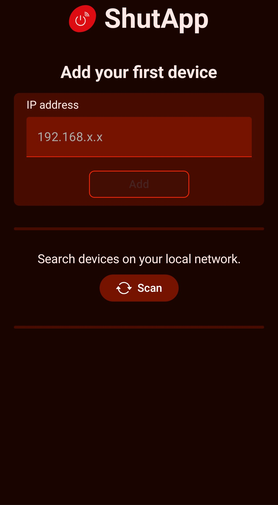
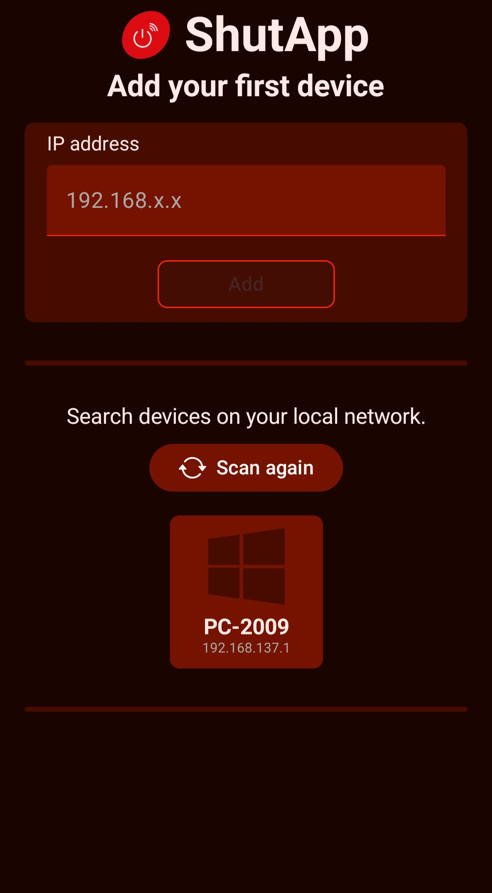
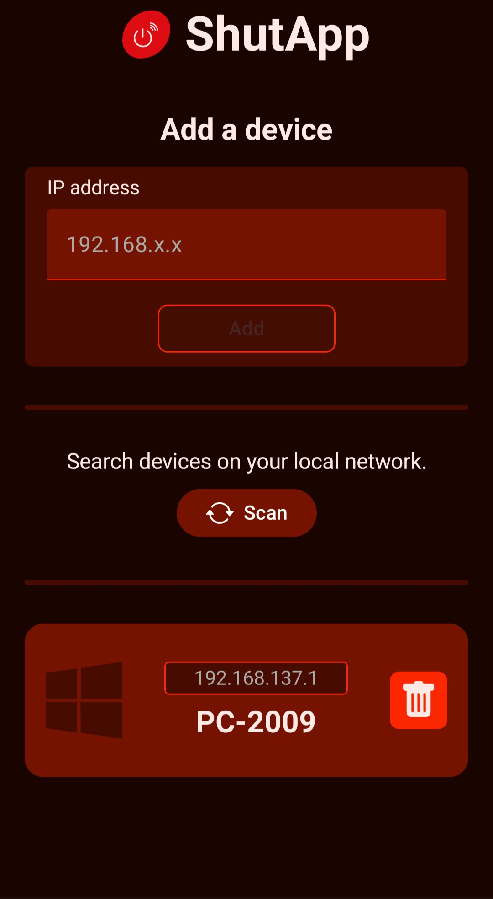
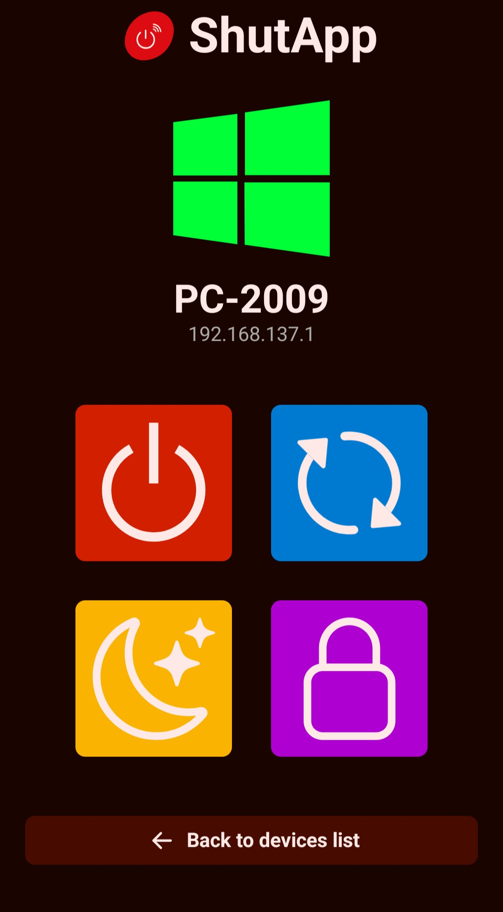

# 📱 ShutApp

This Android app allows you to manage multiple computers on your local network remotely.  
💻 Don't forget to download the [desktop app](https://github.com/S2009-dev/ShutApp-Desktop) too !

## ⚙️ Installation

You can download the APK from the [releases page](https://github.com/ShutApp/ShutApp-Android/releases) or build it yourself using [Android Studio](https://developer.android.com/studio).

## ✨ Features

- Add multiple devices
- Turn them off
- Restart them
- Put them to sleep
- Lock them

## ❤️ Credits

Thanks to [PenTaist](https://pentaist.fr/) for motivating me to create this app, and helping me with the UI and the TCP ports scanning algorithm.

## 📷 Screenshots

